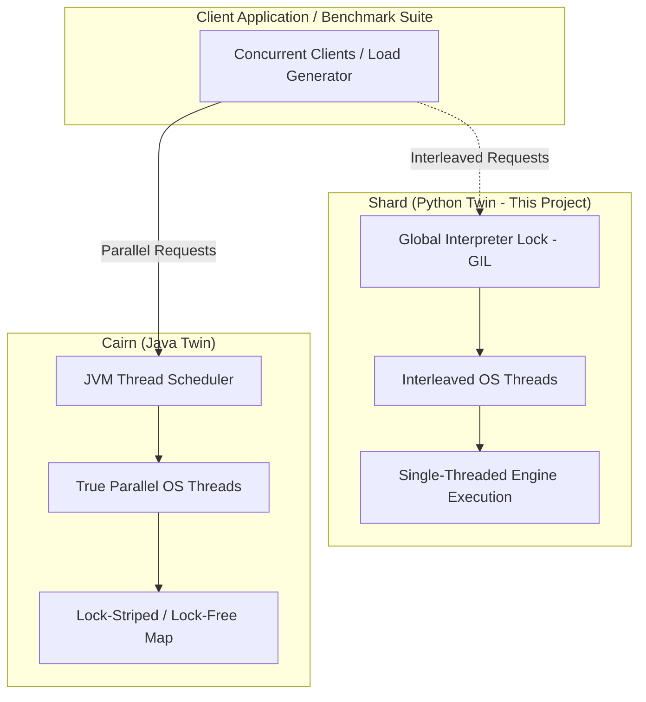

# Product Requirements Document (PRD) — Shard (Distributed Cache Service)

## Document Control
* **Document Version:** 0.1.0
* **Status:** Draft
* **Authors:** Portfolio Owner / Technical Architect
* **Milestone Reference:** v0.1.0 (Docs Complete)
* **Twin Project Reference:** [Cairn (Spring Boot/Java Cache Engine)](file:///d:/Coding/Projects----For%20Resume/Cairn/Docs/PRD.md)

---

## 1. Overview & Problem Statement

### 1.1 What is Shard?
**Shard** is an in-memory, distributed, concurrent key-value cache service built from scratch on Python, Django, and Django REST Framework (DRF). It features pluggable eviction strategies (LRU/LFU), time-based key expiry (TTL), a client-side consistent hashing ring for static multi-node distribution, and a real-time metrics aggregation system.

Unlike typical web applications that wrap Redis or Memcached, Shard implements its core caching engine directly in Python memory space. This provides fine-grained control over state synchronization, lock contention, memory allocation, and eviction scheduling.

### 1.2 The Concurrency Duel: Shard vs. Cairn
Shard is engineered as the direct functional twin to [Cairn](file:///d:/Coding/Projects----For%20Resume/Cairn/Docs/PRD.md), an identical cache engine implemented in Spring Boot/Java 21. 

While Shard and Cairn share the exact same features, API endpoints, and architectural boundaries, their implementation languages represent two fundamentally different approaches to concurrency:
* **Shard (Python/Django):** Bound by Python’s Global Interpreter Lock (GIL). Multi-threading in Shard is essentially time-sliced/interleaved execution on a single CPU core. Concurrency limits are bound by interpreter locks rather than hardware constraints.
* **Cairn (Java/Spring Boot):** Utilizes the JVM’s native, true multi-threaded parallel execution model. Threads run simultaneously across multiple physical CPU cores. This necessitates explicit concurrency control, lock striping, atomic memory operations, and careful consideration of memory visibility and CPU cache lines.



By maintaining identical functional requirements, Shard and Cairn serve as a direct comparative study of concurrent throughput, latency distributions under load, CPU utilization efficiency, and the engineering complexity required to guarantee thread safety in true parallel environments versus GIL-isolated runtimes.

---

## 2. Goals & Non-Goals

To maintain a realistic scope for an engineering portfolio project, the system boundaries are strictly defined.

### 2.1 Goals
* **GIL-Conscious Concurrency & Safety:** Implement a thread-safe (or event-safe) cache engine in Python that guarantees zero state corruption under high-contention concurrent operations (reads, writes, active/passive evictions).
* **Pluggable Eviction Strategy:** Establish an eviction framework utilizing the Strategy Pattern, allowing cache instances to switch between Least Recently Used (LRU) and Least Frequently Used (LFU) eviction algorithms at startup via Django settings.
* **Dual Expiration Mechanics:** Guarantee that expired keys are never served (passive eviction) and that memory is reclaimed predictably via background sweeps (active eviction).
* **Static Horizontal Scaling:** Implement consistent hashing to shard keys across multiple nodes, presenting a unified logical cache ring to the client.
* **Deep Observability:** Capture microsecond-level latency percentiles, hit/miss ratios, and memory stats to facilitate direct benchmarking against [Cairn](file:///d:/Coding/Projects----For%20Resume/Cairn/Docs/PRD.md).

### 2.2 Non-Goals
* **Redis Protocol (RESP) Compatibility:** Shard will expose its own REST API via Django views / DRF, not a TCP-level RESP parser.
* **Persistent Storage (No AOF/RDB):** Shard is strictly in-memory. Persistence features (like Redis's Append-Only File or Redis Database backups) are out of scope.
* **Dynamic Cluster Membership:** There is no Gossip protocol, automatic peer discovery, or cluster consensus (e.g., Raft). Node membership in the hashing ring is statically defined via configuration files.
* **High Availability & Replication:** Active node replication, master-slave configurations, and automated failover are out of scope.

---

## 3. Target Users & Use Cases

This project is a high-caliber technical demonstration piece. Its target audience consists of:
* **Technical Recruiters & Engineering Managers:** Evaluating clean architectural patterns, robust code layout, testing practices, and documentation quality in Python/Django.
* **Systems Engineers & Technical Reviewers:** Evaluating Python-specific concurrency mastery, lock mechanisms, async execution profiles, and distributed systems routing design.
* **Benchmark Comparison:** Developers analyzing the performance trade-offs of the Python GIL vs. the Java Multi-Threaded Model.

---

## 4. Functional Requirements

The implementation is structured in three progressive phases to ensure a clean, testable evolution of the codebase, matching [Shard — Feature List.md](file:///d:/Coding/Projects----For%20Resume/Shard/Docs/Shard%20%E2%80%94%20Feature%20List.md).

```
+--------------------------------------------------------+
| MVP: Single-Node Engine & Core Cache API               |
| - Key-Value Core, Safe Map, LRU/LFU Eviction           |
| - Dual Expiration (Active/Passive), Django/DRF API     |
+---------------------------+----------------------------+
                            |
                            v
+--------------------------------------------------------+
| Phase 2: Static Sharding & Distribution                 |
| - Consistent Hashing Ring (Virtual Nodes)              |
| - Routing/Proxy Layer, Static Cluster Configuration    |
+---------------------------+----------------------------+
                            |
                            v
+--------------------------------------------------------+
| Phase 3: Advanced Invalidation & Observability          |
| - Invalidation APIs, Write-Through/Back Mechanics      |
| - Prometheus Metrics, Django/Grafana Dashboard         |
+--------------------------------------------------------+
```

### 4.1 MVP: Single-Node Engine & Core API
* **FR-1.1: Core Cache Access:** The system must support basic CRUD operations on keys and values (strings):
  * `SET(key, value)`: Creates or updates a cache entry.
  * `GET(key)`: Returns the value or `404 Not Found`/`null`.
  * `DELETE(key)`: Removes the key from the cache.
  * `EXISTS(key)`: Checks presence without affecting LRU/LFU access order.
* **FR-1.2: Swappable Eviction Strategy:** Cache instances must accept a configuration parameter specifying the eviction policy:
  * **LRU (Least Recently Used):** Discards the least recently accessed items first.
  * **LFU (Least Frequently Used):** Discards items with the lowest access frequency count first.
  * *Constraint:* Eviction must execute in $O(1)$ time complexity to prevent system slowdown as the cache size approaches capacity.
* **FR-1.3: Key Expiration (TTL):** Expiration can be specified at write time via `SET(key, value, ttl_seconds)` or via an explicit `EXPIRE(key, ttl_seconds)` command.
* **FR-1.4: Dual Expiry Mechanism:**
  * **Passive Expiry:** During a `GET` or `EXISTS` request, if the key's TTL has elapsed, the cache must immediately evict the key and return null/404, preventing stale data retrieval.
  * **Active Expiry:** A background worker (thread or async task, depending on the concurrency model choice) must periodically sample keys and purge expired ones to free memory.
* **FR-1.5: REST API Boundary:** All core operations must be exposed via standard HTTP methods:
  * `POST /api/v1/cache` (body: `{ "key": "...", "value": "...", "ttl": 60 }`)
  * `GET /api/v1/cache/{key}`
  * `DELETE /api/v1/cache/{key}`
  * `POST /api/v1/cache/{key}/expire` (body: `{ "ttl": 30 }`)
  * `GET /api/v1/cache/{key}/ttl` (returns remaining TTL seconds)

### 4.2 Phase 2: Static Sharding & Distribution
* **FR-2.1: Consistent Hashing Ring:** Shard must implement a client-side consistent hashing ring. Keys must map deterministically to specific nodes. Virtual nodes must be supported to ensure uniform key distribution across the ring.
* **FR-2.2: Static Routing Proxy:** A routing component (middleware, client library, or gateway proxy) must accept operations, hash the key, locate the correct target node on the ring, and proxy the request to that node.
* **FR-2.3: Config-Driven Node Membership:** The set of available cache nodes (host IP and port) must be loaded statically from Django configurations (e.g., `settings.py` or environment variables).
* **FR-2.4: Deterministic Node Transition (Rebalancing):** Although the cluster is static, the system must support manual configuration updates (e.g., adding/removing a node in configuration and restarting/refreshing). The system must document and verify what percentage of keys migrate on node transition, verifying consistent hashing behavior ($K/N$ key movement, where $K$ is total keys and $N$ is number of nodes).

### 4.3 Phase 3: Cache Invalidation & Observability
* **FR-3.1: Explicit Invalidation API:** Support selective key invalidation, wildcard pattern invalidation (e.g., prefix-based purging like `user:*`), and cluster-wide flush.
* **FR-3.2: Write Semantics Simulation:** Implement testable interfaces for:
  * **Write-Through:** Write updates cache and simulated backing database synchronously.
  * **Write-Back (Write-Behind):** Write updates cache instantly, and asynchronously queues database updates.
* **FR-3.3: Metrics Collection:** Expose operational metrics via a `/metrics` Prometheus-compatible endpoint:
  * Hit/Miss Ratio (tracked globally and per-node).
  * Total Evictions (split by policy vs TTL expiration).
  * Active key count and estimated memory footprint.
  * Operation Latency (split into $p50$, $p90$, $p95$, and $p99$ percentiles).
* **FR-3.4: Visual Dashboard:** Provide a lightweight UI dashboard (or Grafana dashboard JSON configuration) summarizing metrics across nodes, allowing developers to visually compare LRU vs. LFU hit rates under different load patterns.

---

## 5. Non-Functional Requirements (NFRs)

These architectural requirements guarantee the engineering rigors of the project and frame the comparison tests with Cairn.

### 5.1 Concurrency & Data Correctness (The Primary NFR)
* **GIL-Aware Synchronization:** Because of Python's GIL, threads are scheduled cooperatively or pre-emptively on a single core. In spite of this, concurrent modifications to Python dictionaries and doubly-linked lists are NOT thread-safe at the byte-code level. Shard must implement lock structures (or an event loop model) to guarantee that concurrent reads, writes, and background TTL sweeps do not corrupt the internal cache structure.
* **Thread-Safety Invariance:** No concurrent operation may corrupt internal pointers, cause memory leaks, or result in out-of-order operations.
* **Granular Lock Scope:** Avoid blocking the entire Django application when modifying cache keys. Lock scopes should be minimized to the engine level or partitioned (similar to Cairn's lock striping) where possible, depending on the chosen concurrency model.

### 5.2 Performance & Latency
* **Sub-Millisecond Engine Latency:** Bypassing HTTP overhead, the cache engine must process read and write actions in sub-millisecond ranges ($< 1$ ms at $p99$ under zero contention).
* **Throughput Scaling Limit:** The document must acknowledge that throughput will *not* scale linearly with the number of CPU cores when using multiple threads due to GIL constraints. If an async model is used, performance will scale up to the capacity of a single CPU core.

### 5.3 Memory & Payload Constraints
* **Memory Limits:** The cache size must be bounded by a maximum key capacity configured at startup (e.g., `SHARD_CACHE_MAX_SIZE = 10000`).
* **Immediate Reclamation:** As soon as the cache size exceeds the maximum size, the configured eviction policy must execute synchronously with the write operation to immediately free memory space.
* **Payload Constraints:**
  * **Key Size Limit:** Keys must not be blank and are capped at a maximum of 250 characters.
  * **Value Size Limit:** Values are capped at a maximum of 1MB (1,048,576 characters).
  * **TTL Bound:** TTL values must be positive integers (minimum 1 second).

### 5.4 Operational & System Constraints
* **Framework:** Python 3.12+ and Django 5.x + Django REST Framework (DRF).
* **No Database Dependencies:** The MVP must run out of the box with zero external database dependencies. Any simulated backing database for write-through/back tests must be mockable in-memory.

---

## 6. Success Metrics

### 6.1 Feature Verification Metrics
| Phase | Metric | Target | Verification Method |
| :--- | :--- | :--- | :--- |
| **MVP** | Concurrency Correctness | 0% Data Corruption / Key collision / Missing pointer exceptions under parallel thread load. | Run concurrency test suite (100 parallel worker threads updating same/different keys). |
| **MVP** | Eviction Accuracy | Exactly $N$ oldest (LRU) or least frequent (LFU) keys are evicted when cache capacity is breached. | Automated verification scripts checking cache dump matches expected list. |
| **Phase 2**| Hashing Uniformity | Node key allocation variance must be $< 15\%$ across all static nodes. | Run client benchmark inserting 100,000 keys; inspect distribution per node. |
| **Phase 2**| Rebalance Minimalist Movement | Adding a node to a ring of $N$ nodes must migrate no more than approximately $1/(N+1)$ of keys. | Test script counting key transfers during node addition on the ring. |
| **Phase 3**| Latency Benchmarking | $p99$ Cache API Response time $< 15$ ms (over local network) under a write load of 300 requests/sec. | `locust` or `wrk` load generation script. |

### 6.2 Shard vs. Cairn Comparative Metrics
The comparative success of the two twin projects relies on demonstrating and documenting the differences between Python's GIL model and Java's JVM concurrency model.

| Metric Area | Shard (Python) Target/Behavior | Cairn (Java) Target/Behavior | Target Verification Method |
| :--- | :--- | :--- | :--- |
| **Throughput Scaling vs Cores** | Plateaus at $1 \times$ core equivalent capacity regardless of client threads. | Scales linearly with physical CPU cores (up to hardware limits). | Benchmarking suite running $1$, $2$, $4$, and $8$ client threads on multi-core CPU. |
| **Contention Tail Latency ($p99$)** | Exponential increase under concurrent write/evict contention due to GIL/Lock wait times. | Flat or gradual sub-linear increase due to lock-striping (`ConcurrentHashMap`). | Load generator hitting a single key with concurrent writes (high contention). |
| **CPU Utilization Profile** | Capped at $100\%$ CPU of a single core (across the entire process). | Can reach $N \times 100\%$ CPU (where $N$ is the number of cores). | `htop` or system metrics capture during a 60-second high-load test. |
| **Resource Overhead** | Low initial memory footprint (~30-50MB RAM at idle). | High initial JVM memory footprint (~150-250MB RAM at idle). | Monitor resident set size (RSS) of processes at idle vs. under load. |
| **Context Switching Penalty** | Threaded model suffers from interpreter-level cooperative/pre-emptive thread switches without parallel execution gains. | Multi-threaded model leverages OS-level parallel thread execution on separate hardware threads. | Profile context switches using OS profiling tools (`perf`, `cProfile` vs. JVM profiler). |

---

## 7. Assumptions & Constraints

* **Network Overhead:** While the cache engine itself runs in microseconds, REST API exposure introduces HTTP serialization and network overhead. Benchmarks comparing raw engine speed should bypass HTTP (in-memory unit tests), while REST benchmarks should be run on a loopback interface to minimize network jitter.
* **Single-Process Focus for MVP:** The MVP assumes all cache instances run on a single machine or local loopback instances during development to simplify testing.
* **Static Topology:** We assume that node additions/removals are infrequent operations controlled by deployment configurations, not automatic self-healing operations.

---

## 8. Open Questions

> [!IMPORTANT]
> The following architectural decisions require final alignment before starting Phase 1 implementation.

1. **Which Concurrency Model should Shard select?**
   * *Option A: Thread-based Locking (Django WSGI + Python `threading` & `threading.Lock`)*
     * **Pros:** Directly mirrors Cairn's multi-threaded model; easy to write synchronous code; native to standard Django WSGI server deployments (e.g., Gunicorn with sync/thread workers).
     * **Cons:** Suffers from severe GIL contention under parallel execution. OS thread context switching overhead without the benefit of CPU-level parallelism.
   * *Option B: Async Event-Loop-per-Node (Django ASGI + `asyncio` / `uvicorn` / `daphne` or custom event loops)*
     * **Pros:** High concurrent request handling on a single thread; avoids thread context switching overhead; matches modern async Python patterns.
     * **Cons:** Increases complexity due to async database/cache engine interactions; departs from Cairn's literal thread model, changing the comparison to "Single-Threaded Async Event Loop vs. True Multi-Threaded Parallelism".
   * *Decision:* This remains an open design question to be resolved in the Technical Stack and System Architecture phases. Tradeoffs must be quantified and documented.

2. **How should we represent capacity in eviction?**
   * *Option A (Recommended):* Key-Count Limit (e.g., maximum of 5,000 entries). This is deterministic and easy to verify.
   * *Option B:* Memory-Limit (e.g., maximum of 128MB usage). Measuring Python object sizes accurately (using `sys.getsizeof` or custom recursively sized traversals) is notoriously complex, slow, and does not capture memory allocator fragmentation.
   * *Decision:* Proceed with **Option A** for MVP, and evaluate **Option B** as a Phase 3 extension.

---

## 9. Companion Documents Reference

Once the PRD is approved, the following companion documents will be generated to match the structure of the [Cairn Documentation Suite](file:///d:/Coding/Projects----For%20Resume/Cairn/Docs/):
1. **TechStack.md** — Framework and library versions, WSGI/ASGI configurations, test runner setup.
2. **SystemArchitecture.md** — Process model, cache engine design, lock structures, and distribution ring layout.
3. **AppFlow.md** — Sequential flow diagrams of cache accesses, evictions, expirations, and proxy routing.
4. **UIDesign.md** & **DASHBOARD_DESIGN.md** — Wireframes and JSON structures for the dashboard interface.
5. **FolderStructure.md** — Complete codebase folder layout including modules for the caching engine, API, and tests.
6. **DBSchema.md** — Schema definition for the mock database layer (simulating write-through/write-back).
7. **APIContracts.md** — Detailed request/response JSON schemas for all endpoints.
8. **Roadmap.md** — Gantt chart or list of milestones for Shard implementation.
