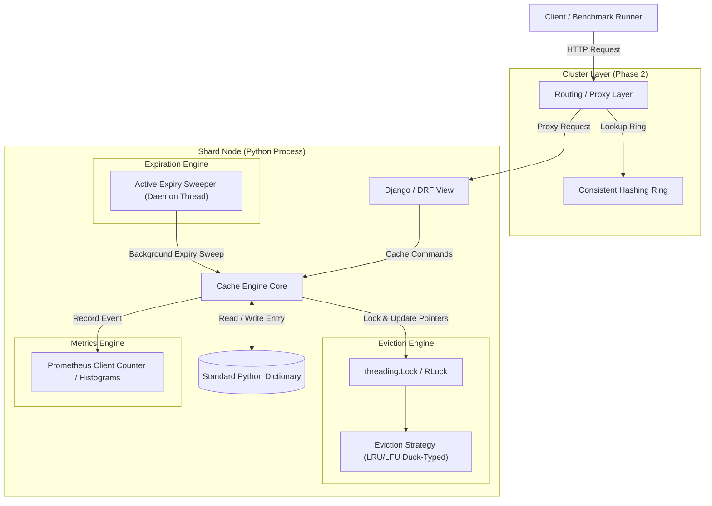
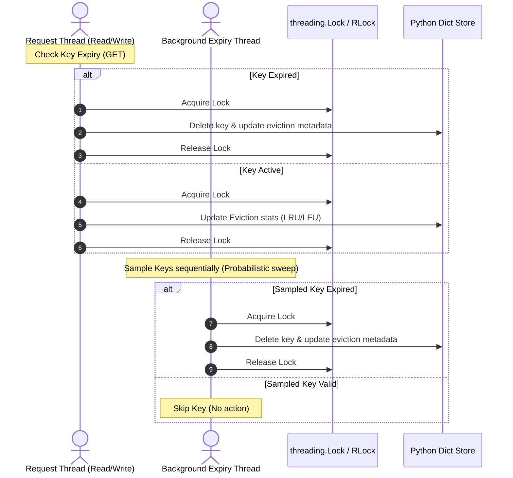
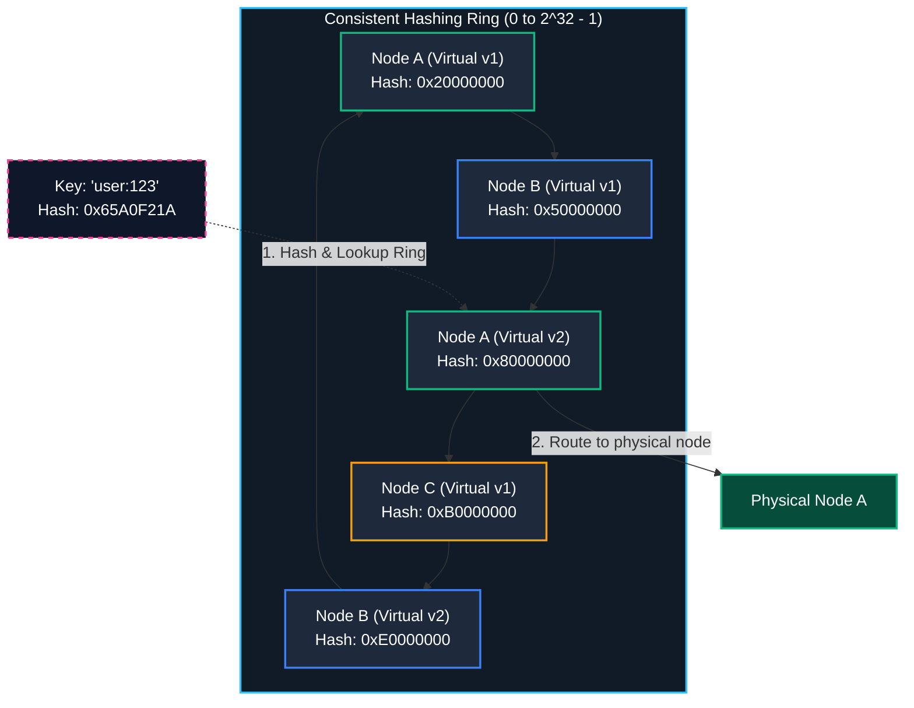

# System Architecture Document — Shard (Distributed Cache Service)

## Document Control
* **Document Version:** 0.1.0
* **Status:** Draft
* **Authors:** Portfolio Owner / Technical Architect
* **Milestone Reference:** v0.1.0 (Docs Complete)
* **Twin Project Reference:** [Cairn System Architecture](file:///d:/Coding/Projects----For%20Resume/Cairn/Docs/SystemArchitecture.md)

---

## 1. High-Level Component Diagram

The following diagram illustrates the flow of requests from the client down to the cache storage and background system tasks within a single node (MVP) and across a cluster (Phase 2).

### Component Flow Description:
1. **Client / Benchmark Runner:** Sends HTTP requests containing cache commands (`SET`, `GET`, `DELETE`).
2. **Routing / Proxy Layer (Phase 2):** Hashes the request key and queries the **Consistent Hashing Ring** to locate the target node, proxying the request to its HTTP port.
3. **REST View (Django/DRF):** Handles HTTP serialization/deserialization and routes requests to the Cache Engine Core.
4. **Cache Engine Core:** Coordinates key access, eviction checks, expiration calculations, and metrics reporting.
5. **Standard Python Dictionary Storage:** The underlying dictionary representing the cache namespace.
6. **Eviction Engine:** Applies either LRU or LFU logic protected by a `threading.Lock` (or `threading.RLock`) to identify and remove keys when memory capacity is reached.
7. **Expiration Engine:** Periodically sweeps the cache namespace via a background daemon thread to evict keys whose time-to-live (TTL) has passed.
8. **Metrics Engine:** Uses `prometheus_client` to aggregate cache hits, misses, evictions, and operation latencies.

---

## 2. Concurrency Architecture

The primary differentiator of Shard is how concurrency is managed under the Python Global Interpreter Lock (GIL). Unlike Cairn, where threads run in parallel, Python threads execute sequentially through interpreter-level time slicing. However, because thread context switches can happen at any bytecode boundary, explicit locking is required to prevent state corruption.

### 2.1 Synchronization Boundaries
* **Index Access & Compound Operations:** Although simple read/write operations on a Python dictionary are atomic under the GIL, compound operations (e.g., checking if a key exists, reading it, updating its position in an eviction list, and writing it back) are not atomic. A thread context switch during these steps can lead to race conditions.
* **Eviction Metadata Synchronization:**
  * To implement $O(1)$ eviction, policies (like LRU) must maintain a linked list. Modifying linked list pointers (e.g., changing `prev` and `next` references on list nodes) requires multiple steps.
  * A `threading.Lock` protects this metadata.
  * When a key is read (`GET`), the cache thread obtains the lock to verify the value and promote the key's position in the eviction list.
  * When a write occurs (`SET`), if the capacity limit is breached, the thread obtains the lock to isolate eviction pointers, identify the victim key, delete it from the dictionary, and remove it from the list.

### 2.2 Expiry Sweep & Request Thread Interaction
To prevent background operations from bottlenecking active user requests, expiration is executed via a two-tier mechanism:
1. **Passive Expiration (Synchronous):** When a user requests a key via `GET`, the request thread checks if `currentTime > expiryTime`. If expired, it triggers a delete, records a miss, and returns null.
2. **Active Expiration (Asynchronous):** A background daemon thread (`threading.Thread`) executes an active sweep task at a configured interval. To avoid locking the entire cache for a long period, the thread performs a **probabilistic sample scan** (similar to Redis). It samples $N$ keys under the lock, evicts expired ones, and releases the lock. This keeps lock hold times short and minimizes contention with request threads.

---

## 3. Phase 2 Distributed Architecture

Consistent hashing allows the cache to scale horizontally across multiple static Python/Django processes.

### 3.1 Consistent Hashing Ring
* **Representation:** Built using a sorted structure (e.g., a sorted list or a `bisect` module helper) containing virtual nodes mapped to their respective physical cache nodes.
* **Virtual Nodes:** To prevent key concentration on a single node, each node configures $V$ virtual nodes (defaults to 150). Each virtual node is placed on the ring by hashing the string representation of its physical index (e.g., `Node-A#1`, `Node-A#2`).
* **Routing Algorithm:**
  1. Hash the requested cache key using a Murmur3 hash function to get a hash value $H$.
  2. Query the ring using a binary search (via Python's `bisect` module) to find the first virtual node whose hash is greater than or equal to $H$.
  3. If no such node exists, wrap around to the first entry in the ring.
  4. Forward the HTTP command to the physical node owning that virtual node.

### 3.2 Node Transition & Rebalancing Behavior
Since membership is **static** (read from configuration at boot), node additions and removals are calculated offline:
* When a node is added/removed from the configuration file and the routing layer is updated, the ring recalculates.
* Consistent hashing ensures that only $K/N$ keys migrate to new nodes (where $K$ is total keys and $N$ is total nodes), preventing a cascading miss storm across the entire cache cluster.

---

## 4. Phase 3 Architecture: Metrics & Invalidation

### 4.1 Invalidation Hook
Cache invalidations (individual, wildcard, or cluster-wide flushes) trigger write updates across the dictionary and eviction lists. Wildcard invalidations (e.g., prefix match `user:*`) scan keys within the dictionary and purge matches, protected by the global cache lock.

### 4.2 Metrics Aggregation
Recording metrics like latency percentiles and hit rates can degrade cache performance if not designed carefully.
* **Metrics Storage:** Shard utilizes `prometheus_client` counters, gauges, and histograms.
* **Lock-Free Counters:** Python's C implementation of primitive increments on scalar variables is thread-safe due to the GIL. However, to ensure absolute thread safety and portability across Python implementations, counter increments are performed under a lock or wrapper.
* **Latency Histograms:** Latency percentiles ($p50, p99$) utilize decay reservoirs managed by the `prometheus_client` library, keeping metrics overhead negligible.

---

## 5. Architectural Differences vs. Cairn (The Concurrency Diff)

While Shard and Cairn share identical component boundaries and APIs, they differ fundamentally in how execution and memory synchronization are handled.

| Architectural Component | Shard (Django / Python Twin) | Cairn (Spring Boot / Java Twin) |
| :--- | :--- | :--- |
| **Execution Model** | Single-threaded process execution loop. Concurrency is simulated by context-switching threads or workers under the Python GIL. | Multi-threaded native thread execution. Threads run in parallel across physical CPU cores. |
| **Store Synchronization** | Uses a standard Python `dict` protected by a `threading.Lock`. Dict access itself is relatively simple, but compound operations must be explicitly locked. | Uses `ConcurrentHashMap` with bucket-level lock-striping, allowing parallel updates while keeping reads lock-free. |
| **Eviction Pointer Mutations** | Doubly-linked list pointer mutations must acquire a `threading.Lock` to block context switching during pointer re-assignment. | Eviction pointer changes must acquire a `ReentrantReadWriteLock` (ReadLock for hits, WriteLock for discards) to prevent memory visibility issues. |
| **Active Expiration Sweeper** | Runs as a background daemon thread, acquiring the cache lock during sample pruning. Context switches are time-sliced. | Runs as a separate OS thread in a daemon thread pool, executing concurrent deletes in parallel with user request handling. |
| **Resource Footprint** | Low initial memory footprint (~30MB) but limited throughput scaling. | Higher initial JVM memory footprint (~150MB) but scales throughput linearly with CPU cores. |
