# Interface & UI Design Document — Shard (Distributed Cache Service)

## Document Control
* **Document Version:** 0.1.0
* **Status:** Draft
* **Authors:** Portfolio Owner / Technical Architect
* **Milestone Reference:** v0.1.0 (Docs Complete)
* **Twin Project Reference:** [Cairn UI Design](file:///d:/Coding/Projects----For%20Resume/Cairn/Docs/UIDesign.md)

---

## 1. Scope of Interfaces

Shard is a backend system utility. It is consumed programmatically by client applications. Its interfaces are divided into two distinct categories based on phase boundaries:

1. **REST API Interface (MVP & Phase 2):** The primary interface for all CRUD cache interactions. Designed for developer ergonomics, performance, and descriptive status reporting using Django REST Framework.
2. **Metrics & Performance Dashboard (Phase 3):** An operator/developer facing dashboard to compare eviction policies (LRU vs. LFU) under load and monitor node cluster balance.

> [!NOTE]
> During MVP and Phase 2, Shard has **no graphical user interface**. It operates strictly as an API-only service. 

---

## 2. REST API Contract & Payloads (MVP)

All REST request bodies and responses are formatted as JSON payloads.

### 2.1 SET Cache Entry
* **Endpoint:** `POST /api/v1/cache`
* **Request Header:** `Content-Type: application/json`
* **Request Payload:**
  ```json
  {
    "key": "user:profile:1004",
    "value": "{\"name\": \"Alice\", \"role\": \"admin\"}",
    "ttl": 3600
  }
  ```
  *(Note: `ttl` is optional. If omitted, the key has no expiry unless forced by eviction policies.)*
* **Response (New Insert):** `201 Created`
  ```json
  {
    "status": "success",
    "message": "Key created successfully",
    "key": "user:profile:1004",
    "expiry": "2026-08-13T11:12:11Z"
  }
  ```
* **Response (Overwrite Existing):** `200 OK`
  ```json
  {
    "status": "success",
    "message": "Key updated successfully",
    "key": "user:profile:1004",
    "expiry": "2026-08-13T11:12:11Z"
  }
  ```
* **Error Response (Capacity Eviction Failure / Out of Memory):** `507 Insufficient Storage`
  ```json
  {
    "status": "error",
    "errorCode": "EVICTION_FAILED",
    "message": "Cache capacity reached and eviction was unable to free memory.",
    "timestamp": "2026-08-13T11:12:11.452Z"
  }
  ```

---

### 2.2 GET Cache Entry
* **Endpoint:** `GET /api/v1/cache/{key}`
* **Response (Cache Hit):** `200 OK`
  ```json
  {
    "key": "user:profile:1004",
    "value": "{\"name\": \"Alice\", \"role\": \"admin\"}",
    "ttl_remaining": 3598
  }
  ```
* **Response (Cache Miss / Expired):** `404 Not Found`
  ```json
  {
    "status": "error",
    "errorCode": "KEY_NOT_FOUND",
    "message": "Requested key does not exist or has expired.",
    "timestamp": "2026-08-13T11:12:15.112Z"
  }
  ```

---

### 2.3 DELETE Cache Entry
* **Endpoint:** `DELETE /api/v1/cache/{key}`
* **Response (Delete Successful):** `204 No Content` *(No response body)*
* **Response (Key Absent):** `404 Not Found`
  ```json
  {
    "status": "error",
    "errorCode": "KEY_NOT_FOUND",
    "message": "Cannot delete key: key does not exist.",
    "timestamp": "2026-08-13T11:12:20.005Z"
  }
  ```

---

### 2.4 EXISTS / EXPIRE / TTL Operations
* **EXISTS:** `GET /api/v1/cache/{key}/exists`
  * **Response (Hit):** `200 OK` -> `{ "key": "user:profile:1004", "exists": true }`
  * **Response (Miss):** `200 OK` -> `{ "key": "user:profile:1004", "exists": false }`
* **EXPIRE:** `POST /api/v1/cache/{key}/expire`
  * **Request Payload:** `{ "ttl": 300 }`
  * **Response (Hit):** `200 OK` -> `{ "key": "user:profile:1004", "ttl_updated": 300 }`
  * **Response (Miss):** `404 Not Found` -> *(Standard error payload)*
* **TTL:** `GET /api/v1/cache/{key}/ttl`
  * **Response (Hit):** `200 OK` -> `{ "key": "user:profile:1004", "ttl_remaining": 298 }`
  * **Response (No Expiry):** `200 OK` -> `{ "key": "user:profile:1004", "ttl_remaining": -1 }`
  * **Response (Miss):** `404 Not Found`

---

## 3. Metrics Dashboard Wireframe (Phase 3)

The Phase 3 dashboard is a diagnostic tool used to compare performance. For example, developers can run identical workloads and toggle eviction settings between LRU and LFU to see which policy yields a better hit ratio in this Python runtime.

### 3.1 Dashboard Layout Design (ASCII Wireframe)

```mermaid
flowchart TB
    subgraph Dashboard ["Shard Dashboard UI Layout Structure"]
        direction TB

        %% Header
        subgraph Header ["Header Area"]
            Title["Title: SHARD CACHE - DISTRIBUTED METRICS DASHBOARD"]
            Controls["Controls: Auto-Refresh Toggle | Cluster Config Summary | Active Eviction Policy (LRU/LFU)"]
        end

        %% Node Cards Row
        subgraph NodesRow ["Cluster Health Cards Row"]
            direction LR
            NodeA["Node A Card<br/>Status: Active<br/>Keys: 12.4k/20k<br/>CPU: 12% | Mem: 34MB"]
            NodeB["Node B Card<br/>Status: Active<br/>Keys: 12.1k/20k<br/>CPU: 14% | Mem: 32MB"]
            NodeC["Node C Card<br/>Status: Active<br/>Keys: 12.8k/20k<br/>CPU: 11% | Mem: 36MB"]
        end

        %% Operational Metrics Section
        subgraph MetricsSection ["Operational Metrics Section"]
            direction LR
            subgraph HitMissCol ["Throughput & Efficiency"]
                HitMissGauge["Hit/Miss Ratio Gauge<br/>(Aggregated Hits vs Misses %)"]
            end
            subgraph LatencyCol ["Performance & Percentiles"]
                LatencyChart["Latency Percentiles Chart<br/>(p50, p95, p99 GET/SET/DELETE)"]
            end
        end

        %% Eviction & Expiry Section
        subgraph EvictionSection ["Eviction Event Counters Row"]
            direction LR
            TTLExpirations["TTL Expirations Counter<br/>(Passive/Active Sweeper Reclaims)"]
            CapacityEvictions["Capacity Evictions Counter<br/>(LRU/LFU Key Expulsions)"]
        end

        %% Logs Stream Section
        subgraph LogsSection ["System Logs & Metrics Stream"]
            LogConsole["Real-time Console Stream<br/>(Node status updates, policy alerts, sweeps)"]
        end

        Header --> NodesRow
        NodesRow --> MetricsSection
        MetricsSection --> EvictionSection
        EvictionSection --> LogsSection
    end

    %% Styles
    style Dashboard fill:#0f172a,stroke:#334155,stroke-width:2px,color:#fff
    style Header fill:#1e293b,stroke:#475569,stroke-width:1px,color:#fff
    style NodesRow fill:#1e293b,stroke:#475569,stroke-width:1px,color:#fff
    style MetricsSection fill:#1e293b,stroke:#475569,stroke-width:1px,color:#fff
    style EvictionSection fill:#1e293b,stroke:#475569,stroke-width:1px,color:#fff
    style LogsSection fill:#1e293b,stroke:#475569,stroke-width:1px,color:#fff
    
    style NodeA fill:#022c22,stroke:#10b981,stroke-width:2px,color:#fff
    style NodeB fill:#022c22,stroke:#10b981,stroke-width:2px,color:#fff
    style NodeC fill:#022c22,stroke:#10b981,stroke-width:2px,color:#fff
    style HitMissGauge fill:#172554,stroke:#3b82f6,stroke-width:1px,color:#fff
    style LatencyChart fill:#3b0764,stroke:#a855f7,stroke-width:1px,color:#fff
    style TTLExpirations fill:#1c1917,stroke:#78716c,stroke-width:1px,color:#fff
    style CapacityEvictions fill:#451a03,stroke:#f97316,stroke-width:1px,color:#fff
    style LogConsole fill:#0c0a09,stroke:#292524,stroke-dasharray: 5 5,color:#a8a29e
```



*Memory figures are informational only — Shard enforces capacity via key-count limits (`SHARD_CACHE_MAX_SIZE`) per PRD §8 Q2; memory-based capacity enforcement is an unimplemented future consideration, not an active constraint.*

### 3.2 Key Visualizations & Charts
1. **Cluster Health Cards:** Shows individual CPU, Memory, and Active Key Count to easily spot ring distribution issues (hot spots) or node outages under Gunicorn.
2. **Hit/Miss Gauge:** Displays the hit/miss ratio, helping developers tune eviction sizing and choices.
3. **Latency distribution graph:** Shows $p50$, $p95$, and $p99$ metrics to evaluate the performance impact of lock contention and GIL wait times on live traffic.
4. **Eviction Breakdown Counter:** Distinguishes between keys that naturally expired (TTL) and keys forced out by memory limits (LRU/LFU), showing if the cache is undersized.
