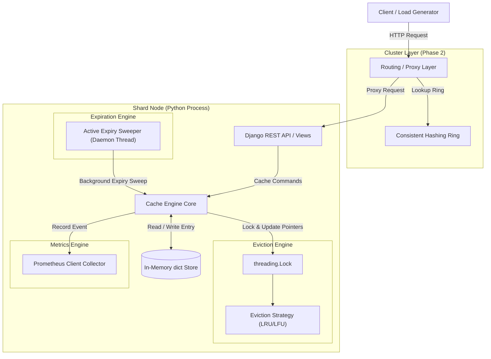
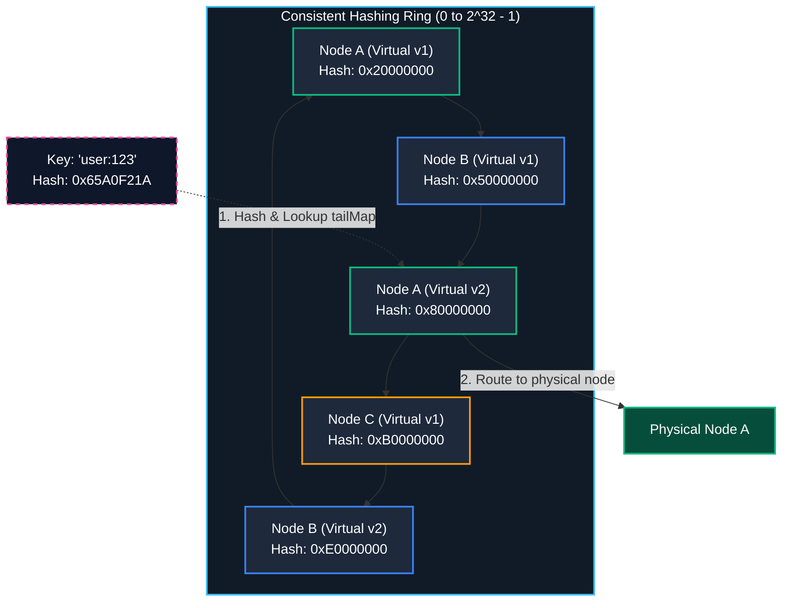

# Shard

Shard is an in-memory, distributed, concurrent key-value cache service built from scratch on Python, Django, and Django REST Framework (DRF). It operates as a lightweight cache server that implements its core caching engine directly in the Python memory space. The system features pluggable eviction strategies (LRU and LFU), time-based key expiration (TTL), active and passive eviction sweeps, and a client-side consistent hashing ring that enables static multi-node key distribution.

Shard is engineered as the direct functional twin to [Cairn](https://github.com/vaibhv19/Cairn) (a Spring Boot/Java implementation). While sharing identical features, API contracts, and architectural boundaries, the two projects showcase fundamentally different execution environments: Shard uses Python's thread-based locking under the Global Interpreter Lock (GIL) (simulating concurrency via time-sliced execution on a single core), while Cairn leverages the JVM's native multi-threaded parallel execution model. By maintaining functional symmetry, Shard and Cairn serve as a comparative study of concurrent throughput, CPU utilization efficiency, and synchronization complexity between GIL-bound interpreters and multi-core parallel runtimes.

---

## Related Writing

* [Same System, Different Languages](https://vaibhav19.vercel.app/writing/what-i-learned-from-building-the-same-distributed-cache-in-java-and-python)

---

## Component Architecture

Below is the component layout of a single Shard node and its interaction within a sharded cluster:



### Consistent Hashing Ring (Distributed Routing)

In a sharded cluster (Phase 2), cache operations are routed to target nodes using a consistent hashing ring. Keys are mapped via a Murmur3-32 hash function onto a virtual node ring. Each physical node registers 150 virtual nodes on the ring to prevent hot-spot key concentration:



---

## Features

### MVP — Single-Node Cache
- **CRUD Operations:** In-memory key-value operations exposing `SET`, `GET`, `DELETE`, and `EXISTS` checking via standard HTTP methods.
- **TTL / Key Expiration:** Supports setting key-specific time-to-live durations at write time.
- **Dual Expiry Mechanisms:**
  - *Passive Expiry:* Evaluates expiration lazily during request access, immediately removing expired items.
  - *Active Expiry:* Background daemon thread (`ActiveExpirySweeper`) periodically samples batches of keys and purges expired entries to reclaim memory.
- **Swappable Eviction Strategy:** Supports pluggable eviction strategies (LRU and LFU) switching at start-up via settings. Eviction logic maintains $O(1)$ operations under a global lock to protect consistency.

### Phase 2 — Static Sharding
- **Consistent Hashing Ring:** Client-side ring topology utilizing Murmur3-32 unsigned hashes (`mmh3`) to map cache keys to target nodes.
- **Virtual Nodes:** Assigns 150 virtual nodes per physical instance on the ring to balance keys uniformly and prevent hotspotting.
- **Static Multi-Node Routing & Proxying:** Integrated routing middleware (`NodeRouter`) that hashes incoming request keys and proxies them to the correct node using a pooled `httpx.Client`.
- **Cluster Diagnostics:** Exposes cluster membership and ring topology endpoints (`/api/v1/cluster/health`, `/api/v1/cluster/ring`).

### Phase 3 — Invalidation / Persistence / Observability
- **Cache Invalidation:** Exposes exact-key, wildcard prefix-matching (e.g., `user:*`), and full cache flush (`*`) invalidations.
- **Write Pipeline Simulation:** Interfaces for synchronous `write-through` and asynchronous `write-back` (queue-backed background worker) database write updates.
- **Prometheus Observability:** Emits real-time cache statistics (hit/miss ratios, active key counts, evictions split by policy vs TTL) via standard `/metrics` scraping.
- **Latency Percentiles:** JSON metrics endpoint (`/api/v1/metrics/latency`) tracking request latency percentiles (Max, p50, p95, p99) in milliseconds.
- **Visual Dashboards:** Complete dashboard configuration (`grafana-dashboard.json`) ready to import into Grafana.

---

## Tech Stack

| Technology | Purpose / Role | Version |
| :--- | :--- | :--- |
| **Python** | Core Programming Language & Runtime | `>=3.12` |
| **Django** | HTTP Core Server & Configurations Framework | `>=5.0, <6.0` |
| **Django REST Framework** | API Serialization & REST View Routing | `>=3.15.0, <3.16.0` |
| **Poetry** | Dependency Management & Build Tool | - |
| **mmh3** | Murmur3 Hashing Library (Consistent Ring) | `>=4.0.0` |
| **httpx** | Async-capable HTTP Client for Request Proxying | `>=0.25.0` |
| **prometheus-client** | Exposing Core Cache Performance Metrics | `>=0.20.0, <0.21.0` |
| **pytest / pytest-django** | Testing Runner & Django Integration | `>=8.0.0` / `>=4.8.0` |

### Concurrency & Synchronization
Shard's execution is coordinated using standard library primitives:
- `threading.Lock`: Synchronizes primary lookup index (`dict`) and eviction lists to prevent data corruption from concurrent requests.
- `threading.Thread`: Background daemon threads running the active expiration sweeper and async write-back queue workers.
- `queue.Queue`: Thread-safe FIFO queue coordination for asynchronous write-back execution.

**The Global Interpreter Lock (GIL) Context:**
Shard runs on standard Python threads. Due to the Global Interpreter Lock (GIL), execution is interleaved/time-sliced across client requests on a single CPU core. However, the GIL does not guarantee thread safety for compound dictionary or pointer manipulation operations. Explicit synchronization via `threading.Lock` is implemented to maintain internal memory and pointer consistency.

---

## API Quick Reference

| Method | Endpoint | Purpose |
| :--- | :--- | :--- |
| `POST` | `/api/v1/cache` | Insert or update a cache key-value pair (optional `ttl` in seconds) |
| `GET` | `/api/v1/cache/{key}` | Retrieve value and remaining TTL of a cache key |
| `DELETE` | `/api/v1/cache/{key}` | Remove a key from the cache |
| `GET` | `/api/v1/cache/{key}/exists` | Check key presence without updating eviction metadata |
| `POST` | `/api/v1/cache/{key}/expire` | Update the TTL expiration of a key |
| `GET` | `/api/v1/cache/{key}/ttl` | Retrieve remaining TTL in seconds (-1 if persistent) |
| `POST` | `/api/v1/cache/invalidate` | Invalidate a key or pattern (e.g. `user:*` or `*` for flush) |
| `GET` | `/api/v1/cluster/health` | Retrieve node health, capacity, and active key counts |
| `GET` | `/api/v1/cluster/ring` | Retrieve consistent hashing ring layout |
| `GET` | `/metrics` | Prometheus metrics scraping endpoint |
| `GET` | `/api/v1/metrics/latency` | JSON endpoint exposing latency percentiles (Max, p50, p95, p99) |

*For complete request/response schemas, validation rules, and error handling, see [APIContracts.md](file:///d:/Coding/Projects----For%20Resume/Shard/Docs/APIContracts.md).*

---

## Running Locally

### Prerequisites
- Python `>=3.12`
- Poetry
- Docker (optional, for Prometheus/Grafana observability stack)

### 1. Installation
Clone the repository and install dependencies inside the Poetry virtual environment:
```bash
git clone https://github.com/vaibhv19/Shard.git
cd Shard
poetry install
poetry shell
```

### 2. Configuration
Settings are configured in [settings.py](file:///d:/Coding/Projects----For%20Resume/Shard/shard_project/settings.py). Key parameters:
- `SHARD_CACHE_MAX_SIZE`: Maximum key capacity (default: `1000`).
- `SHARD_EVICTION_POLICY`: `'lru'` or `'lfu'` (default: `'lru'`).
- `SHARD_ACTIVE_EXPIRY_INTERVAL`: Sweep cycle period in seconds (default: `5.0`).
- `SHARD_ACTIVE_EXPIRY_BATCH_SIZE`: Sample count per sweep (default: `20`).
- `SHARD_NODE_ID`: Configures the ID of this instance (default: `'Node-A'`, reads `SHARD_NODE_ID` env variable).
- `SHARD_CLUSTER_NODES`: Hardcoded dictionary mapping node IDs to base URLs.

### 3. Single-Node Execution
To start a single cache instance on port `8000`:
```bash
poetry run python manage.py runserver 127.0.0.1:8000
```

### 4. Multi-Instance Execution (Static Cluster)
To spin up a local sharded cluster using the default configuration, run three separate terminals:
- **Windows (PowerShell):**
  ```powershell
  # Terminal 1 - Node A
  $env:SHARD_NODE_ID="Node-A"
  poetry run python manage.py runserver 127.0.0.1:8000

  # Terminal 2 - Node B
  $env:SHARD_NODE_ID="Node-B"
  poetry run python manage.py runserver 127.0.0.1:8001

  # Terminal 3 - Node C
  $env:SHARD_NODE_ID="Node-C"
  poetry run python manage.py runserver 127.0.0.1:8002
  ```
- **Linux / macOS (Bash):**
  ```bash
  # Node A
  SHARD_NODE_ID=Node-A poetry run python manage.py runserver 127.0.0.1:8000

  # Node B
  SHARD_NODE_ID=Node-B poetry run python manage.py runserver 127.0.0.1:8001

  # Node C
  SHARD_NODE_ID=Node-C poetry run python manage.py runserver 127.0.0.1:8002
  ```

### 5. Prometheus / Grafana Integration
- Metrics scrape endpoints are automatically exposed at `http://127.0.0.1:<port>/metrics`.
- Hook target nodes into your local `prometheus.yml`:
  ```yaml
  scrape_configs:
    - job_name: 'shard-cluster'
      static_configs:
        - targets: ['127.0.0.1:8000', '127.0.0.1:8001', '127.0.0.1:8002']
  ```
- Import [grafana-dashboard.json](file:///d:/Coding/Projects----For%20Resume/Shard/grafana-dashboard.json) directly into Grafana to view hit/miss rates, eviction metrics, and tail latency profiles.

---

## Testing

Tests are split into two categories to isolate quick validation from heavy thread loads:

### Category A — Unit Tests
Validates logic, API behavior, consistent hashing, eviction accuracy, and write semantics in isolation:
```bash
poetry run pytest tests/unit
```

### Category B — Concurrency Stress Tests
Verifies internal pointer thread-safety and lock synchronization under concurrent worker thread schedules:
```bash
poetry run pytest tests/concurrency
```

---

## Repository Structure

```
Shard/
├── cache_app/              # Django App wrapper for Cache API
│   ├── apps.py             # Startup bootstrapping logic
│   ├── singleton.py        # Holds singletons (Engine, Router, Ring)
│   ├── urls.py             # App-level endpoints routing
│   └── views.py            # API request handlers
├── engine/                 # Core Key-Value Cache Engine
│   ├── cache_engine.py     # Main engine class coordinating locks & storage
│   ├── evict/              # Swappable LRU / LFU eviction algorithms
│   ├── expire/             # Active background sweeper daemon thread
│   ├── metrics/            # Prometheus & latency metric collector
│   ├── sharding/           # Consistent hash ring and proxy router
│   └── mock_database.py    # Mock database for write pipelines
├── shard_project/          # Project configurations & settings
├── tests/                  # Test suites
│   ├── unit/               # Category A tests
│   └── concurrency/        # Category B concurrency tests
├── Docs/                   # System engineering documentation
├── pyproject.toml          # Poetry and pytest configuration
└── grafana-dashboard.json  # Grafana dashboard layout config
```

---

## Documentation

- [PRD.md](file:///d:/Coding/Projects----For%20Resume/Shard/Docs/PRD.md)
- [TechStack.md](file:///d:/Coding/Projects----For%20Resume/Shard/Docs/TechStack.md)
- [SystemArchitecture.md](file:///d:/Coding/Projects----For%20Resume/Shard/Docs/SystemArchitecture.md)
- [AppFlow.md](file:///d:/Coding/Projects----For%20Resume/Shard/Docs/AppFlow.md)
- [APIContracts.md](file:///d:/Coding/Projects----For%20Resume/Shard/Docs/APIContracts.md)
- [Roadmap.md](file:///d:/Coding/Projects----For%20Resume/Shard/Docs/Roadmap.md)
- [LEARNING_HANDBOOK.md](file:///d:/Coding/Projects----For%20Resume/Shard/Docs/LEARNING_HANDBOOK.md)

---

## Twin Project

- **[Cairn](https://github.com/vaibhv19/Cairn):** A Spring Boot/Java-based equivalent implementing the same distributed cache engine. Cairn utilizes OS-level multi-threading and lock-striping without GIL overhead, offering a direct JVM-to-Python runtime comparison.
